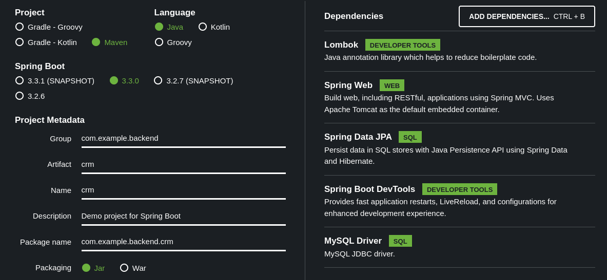
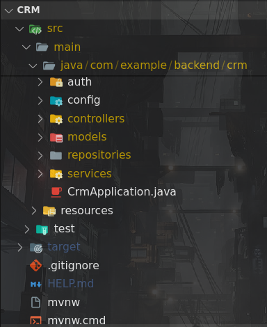
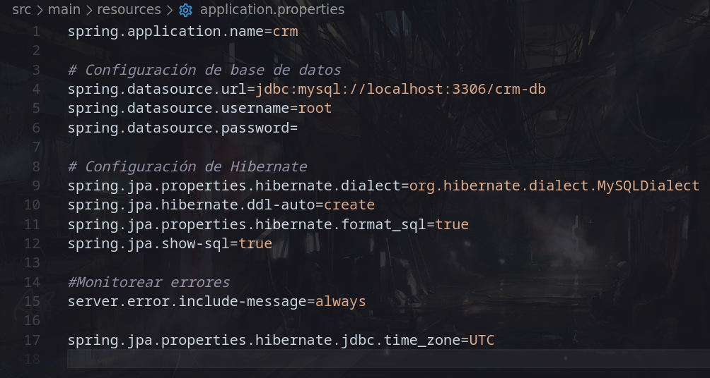
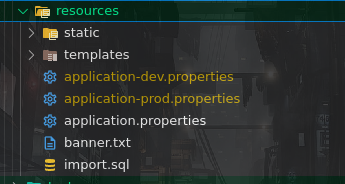
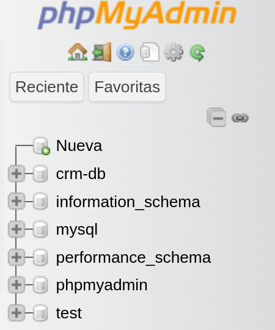
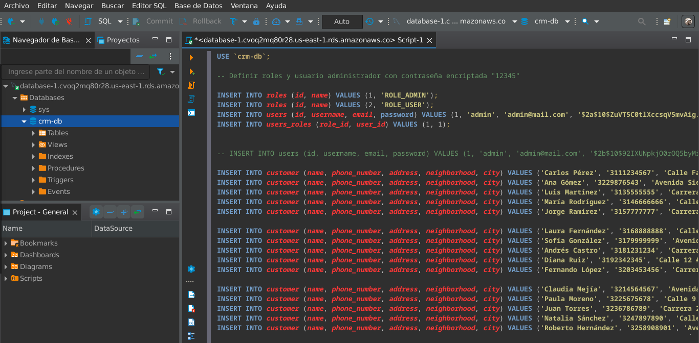
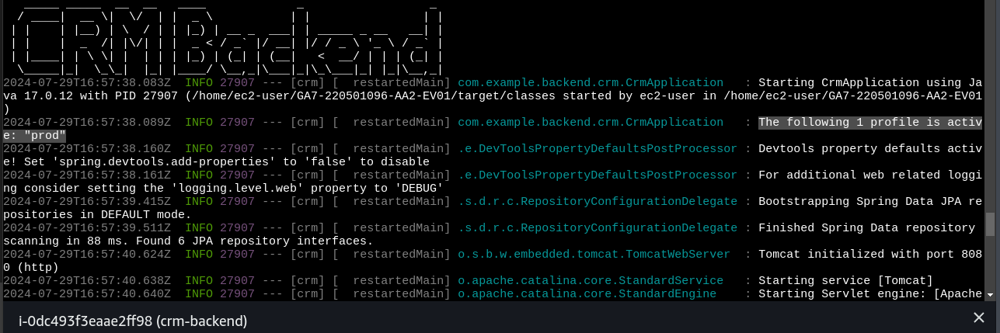

SERVICIO NACIONAL DE APRENDIZAJE 

ANÁLISIS Y DESARROLLO DE SOFTWARE (2758333)

PRESENTADO POR: LUIS MIGUEL RODRIGUEZ VARGAS

INSTRUCTOR: ING. FERNANDO FORERO GOMEZ

Arquitectura del Sistema CRM

El sistema CRM se sustenta en una arquitectura robusta y escalable, diseñada para gestionar de manera eficiente la información de los clientes. Esta arquitectura se compone de los siguientes elementos:

Backend: Desarrollado en Java y utilizando el framework Spring, el backend actúa como el cerebro del sistema. Se encarga de procesar las solicitudes, acceder a la base de datos y ejecutar las operaciones necesarias para mantener la integridad de la información. Spring proporciona un entorno de desarrollo sólido y facilita la gestión de las diferentes capas de la aplicación.

Frontend: Construido con JavaScript y React, el frontend ofrece una interfaz de usuario intuitiva y dinámica. React permite crear interfaces de usuario complejas de manera eficiente y modular, proporcionando una experiencia de usuario óptima.

Base de datos: Utilizamos MySQL como sistema de gestión de bases de datos relacionales. MySQL almacena de forma estructurada toda la información de los clientes, sus interacciones, historial de compras y otros datos relevantes. Su alta performance y fiabilidad garantizan un acceso rápido y seguro a la información.

_________

Creacion del proyecto Spring Boot https://start.spring.io/

Al iniciar un proyecto de Java con Spring se deben seleccionar las dependencias a utilizar, en este caso se importan las siguientes: 

-Lombok: librería para reducir código redundante (métodos getters, setters, constructores, etc.)

-Spring Web: Permite el desarrollo de aplicaciones web con la incorporación de un servidor Tomcat. 

-Spring Data JPA: Proporciona una capa de abstracción entre el usuario y la base de datos, facilitando la creación de aplicaciones que interactúan con una base de datos relational.

-Spring Boot DevTools: Proporciona herramientas para optimizar el desarrollo en ambientes locales
-MySQL Driver: Permite la conexión con MySQL.

____

Estructura de proyecto

Al programar con el modelo de vista-controlador el proyecto se suele estructurar en las siguientes carpetas:

-Models: Representan los objetos de negocio o entidades de la aplicación.

-Repositories: Interactúan con la capa de datos de la aplicación.

-Services: implementan la lógica de negocio de la aplicación.

-Controllers: manejan las solicitudes HTTP y devuelven respuestas.

-Auth: Implementa la gestion de autenticación y autorización

-Config: Configuraciones adicionales

____

Archivo application properties

El archivo aplication.properties es generado automaticamente en el folder src/main/resources y se utiliza para configurar las propiedades del proyecto, en este caso se configura la conexión a base de datos (JDBC- Java Database Connectivity) y la api JPA (Java Persistence API) para convertir objetos Java en registros de base de datos y viceversa.

Los archivos .properties se empaquetan automaticamente con el proyecto segun el perfil seleccionado por el usuario, en este caso, el proyecto permite seleccionar entre perfil de desarrollo y producción

____

Creacion de base de datos

Antes de ejecutar el proyecto se deben crear la base de datos que se haya especificado en el archivo .properties, en este caso “crm-db”.

Para generar datos de muestra y crear un usuario de prueba se debe ejecutar el script SQL ubicado en src/main/resources/import.sql

____

Ejecución del proyecto

